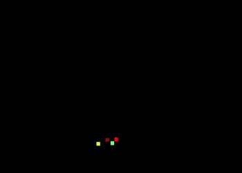

<div align="center">
	<h1> Computer Vision </h1>
</div>

## <p align="center"> Motion Capture </p>

<div align="center">
  	by <a href="https://github.com/andy295">Andrea Cristiano</a> & <a href="https://github.com/MasterCarlo">Carlo Serra</a>
	<br>
	Academic Year 2023 / 2024, University of Trento
</div>

---

## Overview

The project aims to develop a comprehensive understanding of motion capture (mocap) technology, facilitating a deep learning process and enabling students to effectively manage and interact with mocap data. The development involves solving three different tasks that explore the fundamentals and applications of mocap technology.
1. **Task 1: Understanding Standard Output Files**
	- We familiarized ourselves with the standard output files of a motion capture system.
	- Using Python, we visualized human skeleton and rigid body data in 3D.
2. **Task 2: Implementing Filters to Address Occlusion**
	- We implemented two filters: the Kalman filter and the Spline interpolation filter.
	- These filters aim to address the problem of flickering due to occlusion during the acquisition phase.
3. **Task 3: Projecting 3D Joint Positions onto the 2D Camera Plane**
	- Utilizing Unreal Engine and our knowledge of camera geometry, we projected 3D joint positions onto the 2D camera plane.

We present the code used to develop our solution, along with the implementation choices and assumptions that enabled us to achieve the proposed results. More details about the project's development can be found in the accompanying  [Report]().

## Project Sturcture
The `Project` folder contains all the files and scripts necessary to run the project.
The structure of the project is as follows:
```bash
	├── Documentation
	│   ├── Report.pdf
	│   └── Presentation.pdf
	├── Data # input files used to perform the tasks
	│   └── ...
	├── Optional_Task # everithing related to the optional task
	│   ├── Data # input files used to perform the task
	│   │   └── ...
	│   ├── Results # output data obtained by the task
	│   │   └── ...
	│   ├── Lib # libraries used to perform the task
	│   │   └── ...
	│   └── mayn.py
	├── Results # output data obtained by the tasks	
	│   └── ...
	├── bvh_reader # library used to read bvh files
	│   └── ...
	├── I_O.py
	├── data_manipulation.py
	├── experiment.py
	├── global_constants.py
	├── main.py
	├── models.py
	├── plotter.py
	└── utils.py
```
### Task 1
The goal was to familiarize ourselves with the standard output files of a motion capture system. We were provided with files in three different formats: CSV, BVH, and C3D.

For the CSV files, we developed a custom solution in Python to read their content. From  the first file we extracted the x, y, and z coordinates for each joint of the skeleton, along with their connections. From the second one, we extracted the coordinates of the markers of a rigid body. The data for each object were then plotted in 3D using the Matplotlib library, allowing us to observe the positions of the various elements that compose the objects in a 3D space.

| Skeleton | Rigid Body |
| - | - |
|  |  |

For the BVH and C3D files, we decided to use some of the libraries suggested during the course to extract the relevant information. In both cases, the extracted information is stored within dedicated structures designed to be expandable, allowing for the implementation of additional functionalities that can utilize this data.

### Task 2
Task 2 involves using post-processing methodologies on the rigid body data to address the problem of flickering caused by occlusion phenomena. We tackled this issue by implementing two filters: the Kalman filter and the Spline interpolation filter.

| Skeleton | Rigid Body |
| - | - |
|  |  |

### Task 3
The goal of the task was to obtain the 3D to 2D projection of joint positions onto the camera plane. We used Unreal Engine 5 to create and record an animated scene.

| Scene setup |
| - |
|  |

We stored the necessary information in JSON files. Then we used them to achieve the goal.

| 3D to 2D projection |
| - |
|  |

### Usage
The project was developed in `Windows 10` environment using `Python 3.10.9` and `Unreal Engine 5.4.3`. However, with appropriate adjustments, it is possible to use the proposed solution on other enviroments versions.

To run the project, simply execute the `main.py` script. 
```
python3 Project\main.py
```

The solution will provide instructions on available operations. By following these instructions, users can accomplish all the described tasks.

## Optional Task
In the optional task, the objective was to render the provided `BHV` file in `Blender`. We interacted with Blender using its `Python APIs`. To accomplish this task, we relied on [**Deep-Motion-Editing**](https://github.com/DeepMotionEditing/deep-motion-editing) library. Initially designed for `non-Windows` environments, modifications to the library were necessary due to compatibility issues.

[](https://youtu.be/2TT5JsIz6_o)

### Usage
The project was developed in `Windows 10` environment using `Python 3.10.9` and `Unreal Engine 5.4.3`. However, with appropriate adjustments, it is possible to use the proposed solution on other enviroments versions.

To run the project, simply execute the `main.py` script. 
```
python3 Project\Optional_Task\main.py
```

The solution will provide instructions on available operations. By following these instructions, users can accomplish all the described tasks.
